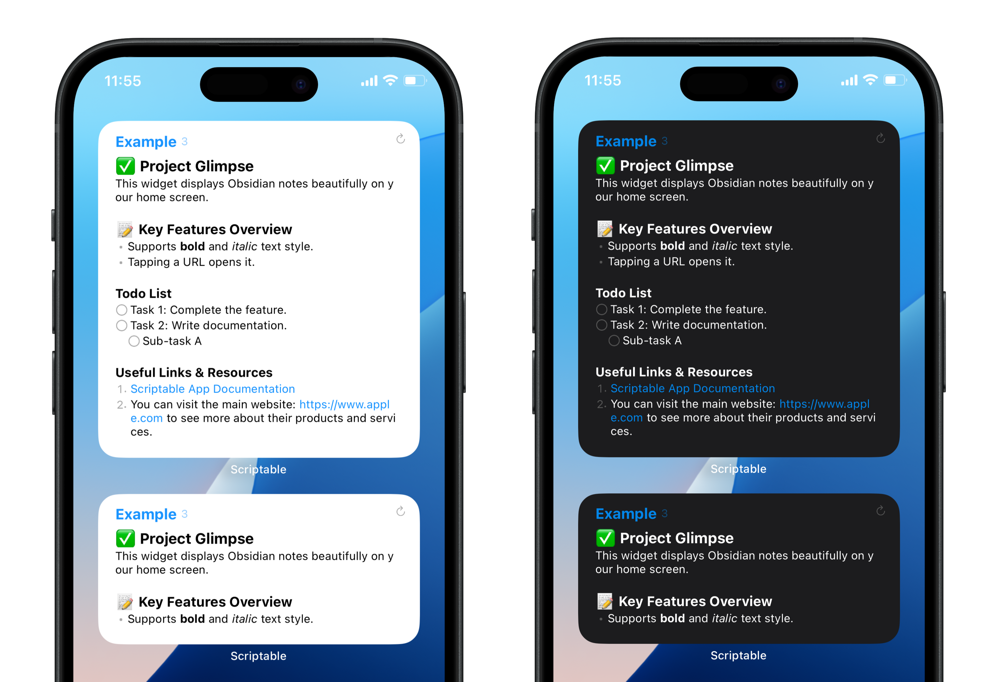

[日本語](README_ja.md)
# Obsidian Widget for Scriptable

This is a Scriptable script to display your Obsidian notes on the iOS/iPadOS home screen widget. It reproduces basic Markdown formats such as headings, lists, bold, italics, and links on the widget.



## ✨ Features

-   **Markdown Support**: Supports headings (`#`), To-do lists (`- [ ]`), bulleted lists (`-`), numbered lists (`1.`), and more.
-   **Text Styling**: Renders `**bold**` and `*italic*` text correctly.
-   **Clickable URLs**: Tapping a URL opens it directly.
-   **Theme Support**: The widget's color scheme automatically switches in conjunction with iOS's Light/Dark mode.
-   **Highly Customizable**: You can finely tune settings like font size, color, line spacing, and displayed items within the script.
-   **Task Management**: A feature to display the number of incomplete tasks on the widget.
-   **Obsidian Integration**: Tapping the widget opens the corresponding note directly in the Obsidian app.
-   **Manual Refresh**: Tapping the refresh icon in the top right corner of the widget reloads the content to its latest state.

## 📥 Installation & Setup

Some preliminary setup is required to use this script.

### Step 1: Download and Place Files

1.  Download the files from this repository.
2.  Install the script file `obsidian_widget.js` into your Scriptable app.
3.  Place the `Images` folder directly inside your `Scriptable` folder in iCloud Drive.

    ```
    iCloud Drive
    └── Scriptable
        ├── obsidian_widget.js  (The script file)
        └── Images               (Place this folder here)
            ├── 0.png
            ...
            └── square.png
    ```

### Step 2: Configure Scriptable's File Bookmarks

You need to register the folder where your Markdown files are stored with Scriptable.

1.  Open the Scriptable app, go to `Settings` > `File Bookmarks` via the gear icon in the top right.
2.  Tap `Add Bookmark` and select the folder containing your Markdown files, such as your Obsidian vault folder.
3.  Enter a **Bookmark Name** (e.g., `obsidian-vault`) and save it. You will use this name in the next step.

> **Note**
> This script is primarily designed for an Obsidian vault, but it can be used with any folder that contains Markdown files directly within it.

### Step 3: Edit the Script

Open the installed `obsidian_widget.js` and configure the following items.

1.  **Set Your Device and Language Type**
    At the top of the script, configure `isPhone` and `USE_FULL_WIDTH_CHARS`. This is important for correct layout and line wrapping.

    ```javascript
    const isPhone = true; // Set to `true` for iPhone, `false` for iPad.
    const USE_FULL_WIDTH_CHARS = false; // Set to `true` if your notes are mainly in Japanese, Chinese, etc.
    ```

2.  **Set `bookmarkedFolderName`**
    Set the bookmark name you configured in Step 2 to the `bookmarkedFolderName` variable.

    ```javascript
    // Example
    const bookmarkedFolderName = 'obsidian-vault';
    ```

3.  **Set `fileName_runsInApp`**
    This is the file name used for test display when you run the script from within the Scriptable app. Set it to an **existing file name** (without the `.md` extension) inside your bookmarked folder.

    ```javascript
    // Example: to display inbox.md
    const fileName_runsInApp = 'example';
    ```

### Step 4: Place the Widget

1.  Long-press on your home screen and tap the "+" icon in the top left to add a widget.
2.  Select `Scriptable` and place a widget of your preferred size on the home screen.
3.  Long-press the placed widget and select "Edit Widget".
    -   **Script**: Select `obsidian_widget`.
    -   **Parameter**: Enter the file name of the note you want to display (without the `.md` extension).

Setup is now complete! Your Obsidian note will be displayed on your home screen.

## ⚙️ Customization

You can customize the widget's appearance by editing the `== Basic Display Settings ==` and `== Color and Style Settings ==` sections at the beginning of the script.

### Basic Display Settings

| Constant Name                | Description                                                                                                                                                                                                           |
| :--------------------------- | :-------------------------------------------------------------------------------------------------------------------------------------------------------------------------------------------------------------------- |
| `isPhone`                    | Set to `true` if you are using an iPhone, or `false` for an iPad. The widget's size and margin calculations differ between devices, so an incorrect setting will cause layout issues.                 |
| `USE_FULL_WIDTH_CHARS`       | Set to `true` if your notes primarily contain full-width characters (e.g., Japanese, Chinese, Korean). This helps improve the accuracy of automatic line wrapping.                                                      |
| `FONT_SIZE`                  | Specifies the font size as a number.                                                                                                                                                                             |
| `LINE_SPACING`               | Specifies the margin between each line as a number.                                                                                                                                                                   |
| `PARTITION_STRING`           | If this string (default `---`) is present in your note, the content below it will not be displayed on the widget.                                                                                                     |
| `SHOW_FIRSTLINE_AS_PLAINTEXT`| If `true`, the first line of the widget will be displayed with the normal text style. If `false`, a special style will be applied.                                                                                      |
| `SHOW_FILENAME_ON_FIRSTLINE` | If `true`, the file name will be displayed on the first line of the widget.                                                                                                                                             |
| `SHOW_TASK_NUMBER`           | If `true`, the number of incomplete tasks will be displayed next to the file name.                                                                                                                                    |

### Color and Style Settings

| Constant Name              | Description                                                                |
| :------------------------- | :------------------------------------------------------------------------- |
| `DARK_BACKGROUND_COLOR`    | Specifies the widget background color in dark mode with a hex color code.  |
| `LIGHT_BACKGROUND_COLOR`   | Specifies the widget background color in light mode with a hex color code. |
| `FIRST_LINE_COLOR_LIGHT`   | Specifies the text color for the first line (e.g., file name) in light mode. |
| `FIRST_LINE_COLOR_DARK`    | Specifies the text color for the first line (e.g., file name) in dark mode.  |

### Advanced Style Settings (`CONFIG` object)

You can make more detailed style adjustments by editing the `CONFIG` object or other parts of the script.

-   **Element Styles**: You can set the color for elements like `h1`, `h2`, `url`, etc., separately for light mode (`color_light`) and dark mode (`color_dark`) within the `CONFIG` object.
    
    > **⚠️ Caution**
    > `fontSizeScale` determines the relative size of each element. Changing this value can disrupt the line-wrapping calculation and **may break the layout**. Please be careful when changing this value.

-   **Changing Checkbox Style**: The default checkbox is a circle (`SFSymbol.named('circle').image`). To use a square checkbox, you can edit the `addListMarker` function. Make sure you have a `square.png` file in your `Images` folder.

    ```javascript
    // Inside the addListMarker function:
    function addListMarker(stack, config, type, listNumber) {
        switch (type) {
            case 'todo':
                // const todoImage = SFSymbol.named('circle').image;
                const todoImage = storeImage('square.png'); // Uncomment this line to use a square checkbox
                addImage(stack, todoImage, config);
                break;
            // ...
        }
    }
    ```

## ⚠️ Notes

-   **About the file hierarchy:**
    -   This script can only display files located **directly within** the folder specified in File Bookmarks. Files in subfolders are not supported.

## Thanks

This script was created with reference to the following projects:

-   Poppo: [【Scriptable】Obsidianのメモをホーム画面に表示する](https://note.com/walking_poppo/n/n31e5ef576e72)
-   Angus Thompson: [obsidian-scriptable-tasks-widget](https://github.com/angus-thompson/obsidian-scriptable-tasks-widget)