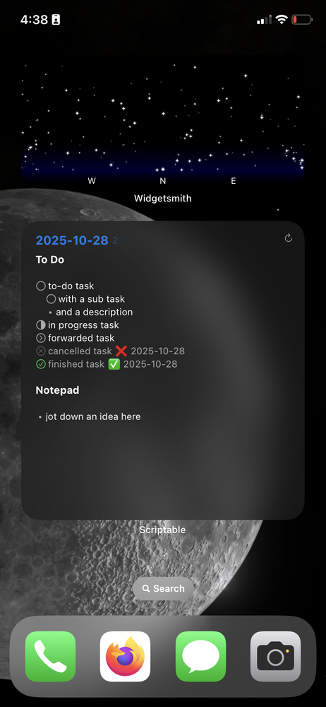

a variation on red-nao's [Obsidian Widget for Scriptable](https://github.com/red-nao/scriptable-Obsidian-Widget).

changes:

1. uses daily note (thanks ruben berenguel for their [scriptable obsidian tutorial](https://mostlymaths.net/2021/12/scriptable-obsidian-widget.html/) for showing how to do this!)
2. set the first line in the note the widget should start rendering
3. shows completed tasks
4. styling for cancelled `- [-]`, forwarded `- [>]`, and in progess `- [/]` tasks added
5. optionally set a background image. i use this with the [transparent & blurred widgets script](https://gist.github.com/mzeryck/3a97ccd1e059b3afa3c6666d27a496c9) ([scriptable gallery link](https://scriptable.app/gallery/transparent-widgets)) to give the widget's background a transluscent effect.

here's what it looks like:

to use the widget, follow the instructions for red-nao's original widget, substituting this repo's `obsidian_widget.js` file. then set the additional following configuration options in the script:

| Constant Name | Description |
| :--------------------------- | :-------------------------------------------------------------------------------------------------------------------------------------------------------------------------------------------------------------------- |
| `START_STRING` | the first line in the daily note you want the widget to show |
| `BACKGROUND_IMAGE` | set to `true` if you want to set a background image for the widget |
| `BACKGROUND_IMAGE_NAME` | the file name of the image you want to use as a background. put this in the "Images" folder |
| `BACKGROUND_IMAGE_COLOR` | this controls the color of the text. set to `dark` if your background image is dark and `light` if your background image is light. leave at `default` if you want the text color to change depending on the device's light/dark mode. |

when you add the widget to the homescreen, the "Parameter" it asks for is the format of your daily notes' file names. the default format the script uses is `yyyy-MM-dd` (ex. `2025-10-28.md`). if you use something else, you must use the syntax `DateFormatter`'s `dateFormat` property uses. you can read about the syntax in scriptable by opening a script, pressing on the note icon on the bottom left, and searching for "dateFormat".